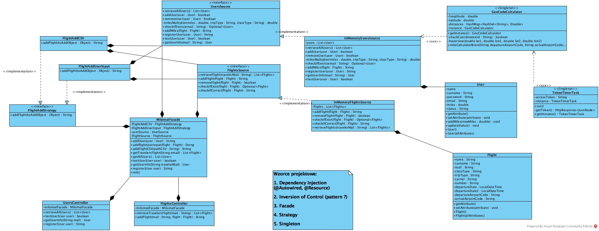

= Milomat

Autorzy:
Jakub Kasprzak, Jan Wojciechowski

CAUTION: Aplikacja działa razem z Java 8.

== Funkcjonalność

Webowa aplikacja Milomat pozwala użytkownikom serwisu na:

* przejrzenie FAQ,
* zarejestrowanie własnego konta,
* zalogowanie się do serwisu,
* przejście na stronę swojego profilu,
* sprawdzenie ilości mil na swoim koncie frequent-flyera,
* sprawdzenie swojego statusu w programie frequent-flyer
* przejrzenie listy odbytych przez siebie lotów,
* dodanie nowego lotu do listy.

== Konfiguracja systemu

Aby wystartować aplikację należy upewnić się, że na komputerze
zainstalowania jest Java w wersji 8 oraz React.js w wersji 16.2.0.

W klasie MilomatFacade.java (com.sabre.academy.uj.ff.services.flights.sources.MilomatFacade)
w metodzie init() należy ustawić odpowiednią ścieżkę do pliku CSV z danymi o lotach
(prowizoryczna baza danych).

== Uruchomienie aplikacji

Aby uruchomić backend wybieramy polecenie Run 'FlightsService.main()'.

Potem przechodzimy w konsoli do folderu frequent-fryer-app i wpisujemy komendę npm start.

Po chwili nasza webowa aplikacja powinna otworzyć się w przeglądarce.

== Użyte technologie

* Java 8
* React.js
* Spring Boot
* Asciidoctor
* JUnit 5

== Opis scenariuszy testowych

=== Rejestracja nowego konta:

. Użytkownik będący na stronie z FAQ, klika w przycisk REGISTER i zostaje przeniesiony
na stronę rejestracji.

. Użytkownik wypełnia pola, a w polu Traveler Mail wpisuje mail będący już w bazie danych
(np.: noah.williams@travel-sabre.com).

. Po kliknięciu przycisku REGISTER z dołu strony wysuwa się okienko z powiadomieniem, mówiącym
o tym, że dany adres email jest już przypisany do innego konta.

. Użytkownik wpisuje inny mail i klika ponownie REGISTER.

. Podany adres nie był przypisany do żadnego konta, pojawia się okienko z napisem potwierdzającym
utworzenie nowego konta, a użytkownik zostaje przeniesiony na stronę startową z FAQ.

=== Sprawdzenie statusu frequent-flyera

. Użytkownik jest na stronie FAQ, naciska przycisk LOGIN, by przejść na stronę logowania.

. Użytkownik wpisuje swój mail oraz hasło, a następnie klika na guzik LOGIN,
jeśli jego dane logowania są prawidłowe, zostaje przeniesiony na stronę z lotami,
jeśli były nieprawidłowe, z dołu strony wysuwa się okienko z odpowiednim komunikatem.

. Na stronie z lotami użytkownik wybiera przycisk z trzema poziomymi liniami w lewym górnym rogu.

. Po chwili pojawia się menu z dostępnymi trzema opcjami: Profile, Flights oraz Logout.
Użytkownik wybiera Profile i zostaje przeniesiony na stronę swojego profilu.

. Na stronie profilu użytkownik może zobaczyć dokładną liczbę mil oraz swój status w programie
frequent-flyer, dodatkowo odpowiadający statusowi obrazek medalu.

=== Dodanie lotu

. Użytkownik jest na stronie FAQ, naciska przycisk LOGIN, by przejść na stronę logowania.

. Użytkownik wpisuje swój mail oraz hasło, a następnie klika na guzik LOGIN,
jeśli jego dane logowania są prawidłowe, zostaje przeniesiony na stronę z lotami,
jeśli były nieprawidłowe, z dołu strony wysuwa się okienko z odpowiednim komunikatem.

. Aby dodać lot użytkownik powinien wypełnić pola z informacjami o locie i nacisnąć przycisk ADD A FLIGHT,
jeśli nie wszystkie pola zostaną wypełnione, przy próbie dodania lotu pojawi się okienko informujące o nieuzupełnieniu
wszystkich pól. Jeśli jakieś pola zostaną źle uzupełnione (np. niedozwolone znaki w kodzie lotnisk), przy próbie dodania lotu,
użytkownik również zostanie o tym poinformowany za pomocą okienka z informacją.

. Jeśli użytkownik spróbuje dodać lot, który kiedyś został już dodany do jego historii lotów,
zostanie o tym poinformowany za pomocą okienka ze stosowną informacją.

. Jeśli użytkownik doda nowy lot, zostanie o tym poinformowany za pomocą wysuwającego się okienka z informacją.

== Diagram klas

